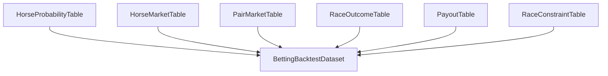

# betting_backtest_dataset 仕様

## 目的
この仕様は、レース直前確率モデルの出力を馬券最適化・バックテストに接続するための入力テーブルを定義する。

モデリング実装自体は別フェーズだが、以下を共通契約として先に固定する。

- 馬単位確率テーブル
- 市場価格テーブル
- 結果・払戻テーブル
- レース制約テーブル
- バックテスト結合テーブル

## 参考資料から追加した原則
- 期待値が 1 を少し超えた程度の券だけを機械的に買うと、確率推定誤差で簡単に負けに転ぶ
- 特に高オッズ帯は、確率のわずかな過大評価が期待値を大きく歪める
- そのため、`期待値 > 1` だけではなく、`校正済み確率` と `安全域` を前提にベット判断を行う
- ROI の評価は必ず `モデルが学習に使っていない期間` だけで実施する

## 全体構造

## 1. `horse_probability_table.parquet`

## 粒度
- `1行 = 1レース1頭`

## 主キー
- `race_id`
- `horse_number`

## 必須列
- `race_id`
- `race_date`
- `venue_code`
- `horse_number`
- `horse_id`
- `horse_name`
- `field_size`
- `model_name`
- `model_version`
- `data_version`
- `prediction_timestamp`
- `p_win`
- `p_top2`
- `p_top3`

## 推奨追加列
- `score_raw`
- `score_calibrated`
- `rank_by_p_win`
- `rank_by_p_top2`
- `rank_by_p_top3`
- `uncertainty_proxy`
- `feature_coverage_score`

## 制約
- 同一レース内で `sum(p_win) ~= 1.0`
- `p_win <= p_top2 <= p_top3 <= 1.0`
- `rank_by_p_win` は 1 から始まる連番

## 用途
- 単勝・複勝・馬単・ワイド・馬連の期待値計算の基礎
- モデル比較と校正評価

## 2. `horse_market_snapshot.parquet`

## 粒度
- `1行 = 1レース1頭`

## 主キー
- `race_id`
- `horse_number`

## 必須列
- `race_id`
- `market_timestamp`
- `snapshot_phase`
- `horse_number`
- `win_odds`
- `place_odds_min`
- `place_odds_max`
- `market_popularity`

## 推奨追加列
- `place_odds_avg`
- `market_implied_win_prob_raw`
- `market_implied_place_prob_raw`
- `odds_source`
- `has_market_snapshot`

## `snapshot_phase` の標準値
- `t_minus_60`
- `t_minus_30`
- `t_minus_10`
- `t_minus_05`
- `off_time_final`

初期版の正式評価は `t_minus_10` を主基準にする。

## 3. `pair_market_snapshot.parquet`

## 粒度
- `1行 = 1レース1組み合わせ1券種`

## 主キー
- `race_id`
- `odds_type`
- `pair`
- `market_timestamp`

## 必須列
- `race_id`
- `market_timestamp`
- `snapshot_phase`
- `odds_type`
- `pair`
- `odds`
- `popularity`

## 条件付き列
- `odds_min`
- `odds_max`

## `odds_type`
- `umaren`
- `wide`
- `umatan`

## 用途
- 組み合わせ市場に対するモデル優位性検証
- 組み合わせ期待値計算

## 4. `race_outcome_table.parquet`

## 粒度
- `1行 = 1レース1頭`

## 主キー
- `race_id`
- `horse_number`

## 必須列
- `race_id`
- `race_date`
- `venue_code`
- `horse_number`
- `horse_id`
- `finish_position`
- `official_finish_position`
- `is_win`
- `is_top2`
- `is_top3`

## 推奨追加列
- `margin_seconds_proxy`
- `status_code`
- `disqualified_flag`
- `late_scratched_flag`

## 用途
- 確率精度評価
- バックテストの的中判定

## 5. `payout_table.parquet`

## 粒度
- `1行 = 1レース1券種1組み合わせ`

## 主キー
- `race_id`
- `bet_type`
- `ticket_key`

## 必須列
- `race_id`
- `bet_type`
- `ticket_key`
- `payout_per_100`
- `is_official_payout`

## `bet_type`
- `win`
- `place`
- `umaren`
- `wide`
- `umatan`

## `ticket_key` の標準
- 単勝: `win:07`
- 複勝: `place:07`
- 馬連: `umaren:03-07`
- ワイド: `wide:03-07`
- 馬単: `umatan:03-07`

## 用途
- 券種別 ROI 算出
- 組み合わせ期待値計算

## 6. `race_constraint_table.parquet`

## 粒度
- `1行 = 1レース`

## 主キー
- `race_id`

## 必須列
- `race_id`
- `race_date`
- `venue_code`
- `surface`
- `distance`
- `field_size`
- `bettable_win`
- `bettable_place`
- `bettable_umaren`
- `bettable_wide`
- `bettable_umatan`

## 推奨追加列
- `market_snapshot_available`
- `pair_market_snapshot_available`
- `has_paddock`
- `has_oikiri`
- `has_cushion_value`
- `scratch_count`
- `refund_rule_flag`

## 用途
- バックテスト時の対象レースフィルタ
- 発売対象と情報整備状況の切り分け

## 7. `betting_backtest_dataset.parquet`

## 粒度
- `1行 = 1レース1馬1snapshot_phase`

これは分析・可視化用の結合済みテーブルで、最適化計算の一次入力として使う。

## 主キー
- `race_id`
- `horse_number`
- `snapshot_phase`

## 必須列
- `race_id`
- `race_date`
- `venue_code`
- `horse_number`
- `horse_id`
- `horse_name`
- `snapshot_phase`
- `p_win`
- `p_top2`
- `p_top3`
- `win_odds`
- `place_odds_min`
- `place_odds_max`
- `market_popularity`
- `finish_position`
- `is_win`
- `is_top2`
- `is_top3`

## 推奨派生列
- `ev_win = p_win * payout_win_per_100 / 100 - 1`
- `ev_place_low = p_top3 * payout_place_low_per_100 / 100 - 1`
- `market_edge_win = p_win - market_implied_win_prob_raw_norm`
- `value_bucket`
- `longshot_flag`
- `favorite_flag`
- `safety_margin_win = ev_win - ev_threshold_buffer`
- `confidence_band`

## 注意
- `betting_backtest_dataset` だけで全券種を完結させない
- 組み合わせ券種は `pair_market_snapshot` と `payout_table` を別 join する

## 7.5 期待値安全域ルール
期待値系の判定は、次の 3 層で管理する。

### 1. 生期待値
- `raw_ev = predicted_prob * odds - 1`

### 2. 校正後期待値
- `calibrated_ev = calibrated_prob * odds - 1`

### 3. 安全域込み期待値
- `safe_ev = calibrated_ev - buffer`

### 初期ルール
- ベット候補は `safe_ev > 0` を最低条件にする
- `buffer` は固定値ではなく、`odds bucket` と `uncertainty_proxy` で可変にする
- 高オッズ帯ほど buffer を厚くする

## 7.6 閾値管理テーブル
将来の戦略比較のため、閾値を別テーブルで管理する。

### `bet_policy_thresholds.json`
- `policy_name`
- `snapshot_phase`
- `bet_type`
- `min_safe_ev`
- `min_model_confidence`
- `exclude_longshot_over_odds`
- `max_tickets_per_race`
- `stake_sizing_rule`

### 目的
- 学習モデルと賭けルールを分離して比較する
- 「モデルは同じだが閾値だけ違う」実験を簡単にする

## 8. 将来の組み合わせ最適化用中間テーブル

## `pair_probability_input.parquet`
後段で馬連・ワイド・馬単の期待値最適化を行うための中間入力。

### 粒度
- `1行 = 1レース1組み合わせ1券種`

### 必須列
- `race_id`
- `odds_type`
- `pair`
- `p_pair_hit`
- `market_odds`
- `market_popularity`
- `expected_value`

### 生成元
- `horse_probability_table`
- `pair_market_snapshot`
- `race_constraint_table`

## 券種別最適化の前提

## 単勝
- 入力: `p_win`, `win_odds`
- 最初に実装しやすい券種

## 複勝
- 入力: `p_top3`, `place_odds_min`, `place_odds_max`
- 初期版は `place_odds_avg` を使い、後でレンジ評価に拡張

## 馬連・ワイド・馬単
- 単体確率だけでは不十分
- 後段で `pair_probability_input` を作る
- 初期段階では市場比較と回収率検証用の入力だけ整える

## バックテストの評価指標
- `stake_count`
- `turnover`
- `return_amount`
- `roi`
- `hit_rate`
- `max_drawdown`
- `odds_bucket_roi`
- `venue_surface_segment_roi`
- `kelly_regret_proxy`
- `selection_rate`
- `race_coverage_rate`
- `avg_safe_ev`
- `avg_realized_edge`

## ルール
- ROI はモデル採択の一次指標にしない
- まず `p_win`, `p_top2`, `p_top3` の校正整合性を確保する
- バックテストは必ず `test` 期間で行い、学習期間とは完全分離する
- レース確定後の最終オッズでしか評価できない指標は、`simulation_only` と明示する
- T-10 オッズと最終オッズを混同しない

## 追加で保存する監査成果物
- `betting_policy_manifest.json`
- `backtest_summary_by_policy.csv`
- `roi_by_odds_bucket.csv`
- `roi_by_segment.csv`
- `expected_value_calibration.csv`

## 配分最適化・予測印と強化学習（関連設計）

券種選択・**予測印と推奨券の結びつけ**・資金配分を、教師あり確率モデルとは切り離し **強化学習（ポリシー）** で扱う設計議論は、次を正とする。

- `docs/modeling/betting_policy_reinforcement_learning.md`（**MDP・報酬・オフライン RL・印のパターン**）
- HTML 要約: `docs/html/betting_rl_policy/index.html`

本書（`betting_backtest_dataset_spec`）は **データ契約・safe_ev・バックテスト指標** が主。RL 環境は本書のテーブルを **simulator の入出力**として写像する。

## 実装順
1. `horse_probability_table` を確定
2. `horse_market_snapshot` を `snapshot_phase=t_minus_10` で固定整備
3. `race_outcome_table` / `payout_table` を整形
4. `betting_backtest_dataset` を生成
5. 券種別に `expected_value` 列を追加
6. `safe_ev` と policy thresholds を別管理にする
7. その後に配分最適化モデルへ進む
