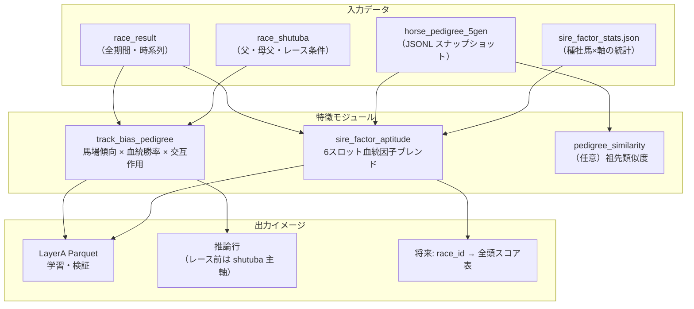
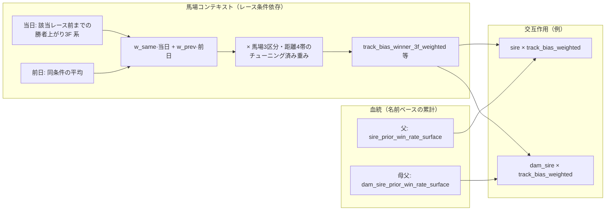
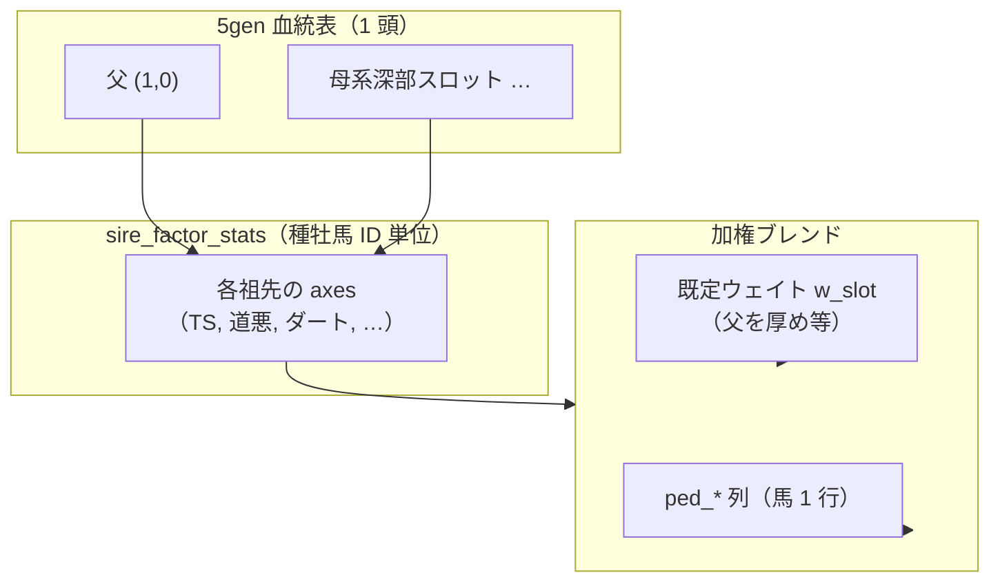
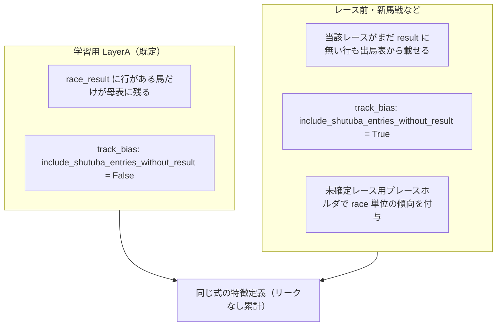
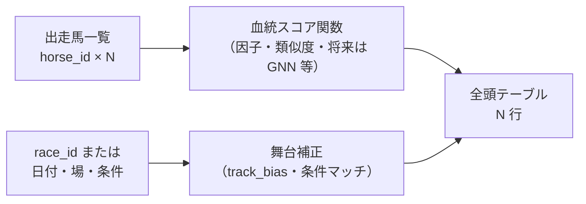

# 血統・馬場傾向・研究方針メモ（ブラッシュアップ用）

この文書は、血統因子・馬場傾向・未出走馬への拡張・研究ロードマップについて、**現状の実装**と**今後の考え**を一枚にまとめたものです。一緒に推敲する前提で、未確定の仮説は「検討中」と明記しています。

---

## 1. ゴール（最終イメージ）

| 項目 | 内容 |
|------|------|
| **最終出力** | **任意の `race_id`（または日付・場・条件）**に対し、**出走馬全頭**について **血統由来の得点**（＋必要なら舞台補正）を返す |
| **制約** | **GCS の read を推論・特徴計算のホットパスに置かない**（ローカル Parquet / スナップショット中心） |
| **未出走馬** | 自分の戦績がなくても、**親・祖先・類似血統**から何らかの「得意分野」を補間できる設計にしたい |

---

## 算出イメージ（図解）

以下は **概念図** です。数式の厳密さより、**データがどこから来て、何と掛け合わさるか**を共有するためのものです。

### 全体の流れ（鳥瞰図）



**テキスト版（ASCII）**

```
  race_result ─────────┐
                       ├──► track_bias_pedigree ──► LayerA / 推論
  race_shutuba ────────┘

  horse_pedigree_5gen ─┐
                       ├──► 6スロット因子 ────────► horse_id 行（Parquet 等）
  sire_factor_stats ───┘
```

---

### 馬場傾向 × 血統（1 レース・1 頭あたりの合成イメージ）

「当日の空気（馬場・距離）」と「血統（父・母父の芝/ダ実績）」を **掛け合わせる**イメージです。



**一文で**:  
`馬場の合成ベクトル` × `親側の芝/ダ勝率` → **「この舞台でこの血統がどう効きそうか」**の代理特徴。

---

### 血統因子ブレンド（6 スロット）のイメージ

5 世代血統表上の **決まった座標**から祖先を拾い、**種牡馬 DB の軸ベクトル**を重み付き平均します（**当該馬のレース履歴は不要**）。



---

### 学習時（結果あり）と レース前推論（結果なし）の違い



---

### 目標：任意レースの「全頭」へのスコア拡張（ドラフト）



**行列イメージ（イメージのみ）**

```
           血統ベース   舞台補正    合成（例）
馬1 (新馬)   ○           ○          f(·,·)
馬2          ○           ○          f(·,·)
…
馬N          ○           ○          f(·,·)
```

`f` は **学習で決める**（線形・GBDT・ランキングなど）は後段の設計。

---

## 2. 現状のパイプライン（コード上の位置）

### 2.1 馬場傾向 × 血統（LayerA / `track_bias_pedigree`）

- **入力**: `race_result`（全期間・時系列）＋ `race_shutuba`（父・母父名など）
- **中身**:
  - **馬場傾向**: 当日（該当レース前）・前日の勝者上がり3F系、**馬場3区分** × **距離4帯** × **芝/ダ/障** で細かく集計し、欠損は粗いキーでフォールバック
  - **血統**: 父・母父の **芝/ダ別のリークなし累計勝率**（産駒全体の過去）
  - **加重**: 当日/前日ブレンド＋（チューニング済み）**馬場区分・距離帯の乗算**
- **チューニング**: `research/tune_track_bias_weights` → `data/meta/modeling/track_bias_weight_best.json`（**version 2**: `cond_multipliers` / `dist_multipliers`）
- **母表への焼き込み**: `python3 -m pipeline.build_layer_a_dataset --track-bias-weights-json ...`

### 2.2 血統因子（6 スロット・種牡馬統計）

- **モジュール**: `research/sire_factor_aptitude`（父・母系深部スロットの加権ブレンド）
- **事前集計**: `data/research/sire_factor_stats.json`（種牡馬ごとの軸ベクトル）
- **馬単位ワイド表（任意）**: `research/pedigree_factor_table` → `data/modeling/horse_pedigree_factors.parquet`（`horse_id` 一発 join 用）

### 2.3 血統構造の類似度

- **モジュール**: `research/pedigree_similarity`（重み付き祖先集合、overlap / dual / λ など）
- **GCS 負荷対策**: `research/pedigree_local_store`（`horse_pedigree_5gen.jsonl.gz` を **1 blob** 取得してローカル化、`list_keys` 全走査を避ける）

### 2.4 新馬・レース前予測（整合性）

- **課題**: 従来、`race_result` に **当該レース行が無い**と特徴が付かない場合があった
- **対応**: `build_track_bias_pedigree_features(..., include_shutuba_entries_without_result=True)`  
  - 出馬表を主軸にマージし、**未確定レース**には SDP 用プレースホルダ行を追加  
  - **日次平均（前日側）は実勝者のみ**で集計（プレースホルダで汚さない）
- **学習用 LayerA** の既定は **`False`**（結果済み行のみ・従来互換）

---

## 3. GCS 負荷を抑える運用原則（合意しやすい形）

1. **学習・チューニング・特徴生成**は **`data/local/tables` と `data/modeling/` の Parquet** で完結させる
2. **5 世代血統**は **スナップショット JSONL.gz を 1 回**取り、以降は **ローカル索引**（`pedigree_local_store`）
3. **馬場傾向の重み**は JSON に保存し、**母表ビルド時に列へ焼く**（推論のたびに全件再計算しない運用も可能）
4. **list_keys("horse_pedigree_5gen") + 馬頭 load** を特徴計算のループに置かない

---

## 4. 研究テーマ（文献とつなげる言い方）

### 4.1 定量遺伝学・育種の語彙

- 血統表は **親子関係のグラフ** → **親縁行列**と **BLUP / ゲノム予測**の文脈で説明できる
- 「未出走馬」＝ **自分の表型が無い**だけで、**親・半兄妹・祖先の表型**から **EBV 的な補間**が可能、というのが理論側の根拠になりうる

### 4.2 手法の段階（案）

| 段階 | 内容 | 既存との対応 |
|------|------|----------------|
| **A** | 6 スロット加権＋種牡馬因子 | `sire_factor_aptitude` / `pedigree_factor_table` |
| **B** | 祖先集合の overlap / λ 合成 | `pedigree_similarity` |
| **C** | レア祖先の **IDF 重み**（共通だがレアな祖先を強調） | 検討中・未実装 |
| **D** | ランダムウォーク / kinship 近似 / 小型 GNN | 検討中・データが揃ってから |

### 4.3 馬場・舞台との結合

- **遺伝 × 環境（G×E）** のように整理すると、**馬場傾向（当日の文脈）**と **血統由来のベース**の **交互作用**として設計しやすい
- 既存の **track_bias × 血統勝率** は、その **実装レベルの第一歩**

---

## 5. 任意レース・全頭スコアに向けた I/O 案（ドラフト）

**入力（案）**

- `race_id`  
  または `date` + `venue` + 条件（芝/ダ/障、距離、馬場区分 など）

**出力（案）**

| 列 | 意味 |
|----|------|
| `horse_id` | 馬 |
| `pedigree_score` | 血統のみの総合 or 主軸スコア |
| `stage_adjusted_score` | 当該レース条件での補正後（任意） |
| `components` | 父系/母系/距離/道悪 等の内訳（JSON 列でも可） |

**データ源（案）**

- ローカル `horse_pedigree_5gen` スナップショット  
- `sire_factor_stats.json` / `horse_pedigree_factors.parquet`  
- 当日の **track_bias 特徴**（`include_shutuba_entries_without_result` 経由の推論用パス）

### 5.1 ファーストステップ: 母系種牡馬 × 舞台別集計（バッチ）

- **スクリプト**: `research/build_maternal_stallion_stage_stats.py`
- **入力**: `data/local/tables/{年}/race_result_flat.parquet`、5 世代血統索引（既定は `data/local/horse_pedigree_5gen/**/*.json` があれば優先、無ければ `KEIBA_PEDIGREE_JSONL_GZ` / `data/research/_ped_snapshot_cache.jsonl.gz`）
- **種牡馬の含有範囲（本節）**: 集計に載せる `stallion_id` は、下記の母系展開で **当馬基準の世代 3〜10 に入るノードに限る**（母系側・最大 10 世代の窓）。`data/research/sire_factor_stats.json` の `sires` は（既定の `--stallions-only` 相当）**その窓内の ID を辞書でさらに絞る**ためのもの。`--no-stallions-only` を付けると辞書絞りを外し、**同じ窓内**のすべての祖先 `horse_id` を対象にできる（窓外の父系全体へ広がるわけではない）
- **母系**: `research/pedigree_similarity.is_maternal_side` と同じ二分木定義。世代 3〜10 は、当馬の 5 世代表で母系に含まれるノードをシードとし、各シード祖先の 5 世代表を **当馬基準世代 `g + r`** として数える（最大 5+5=10）。拡張先の 5 世代表は父・母両系を含む（母系 = 母側 subtree 内の全祖先）
- **舞台キー**: `pipeline/track_bias_pedigree` の `stage_key` に馬場3区分（`track_condition_bucket`）を連結した `full_stage_key`
- **出力**: `data/meta/modeling/maternal_stallion_stage_stats.parquet` と `maternal_stallion_stage_stats_meta.json`
- **年範囲**: `--years` を省略すると `data/local/tables` にある **全エクスポート年**の `race_result_flat` を対象（メタの `years_resolved` に実際に読んだ年が入る）
- **血統 gz**: ローカルに無い場合は `--fetch-pedigree` で `HybridStorage` 経由の GCS スナップショット取得を試せる。馬ごとの母系種牡馬集合はメモ化して全年スキャンを高速化

```bash
# ローカルにある全レース結果で集計（リーク許容のファーストステップ想定）
python3 -m research.build_maternal_stallion_stage_stats --fetch-pedigree

# 年を絞る例
python3 -m research.build_maternal_stallion_stage_stats --years 2024
```

### 5.2 セカンドステップ: 種牡馬祖先グラフ（父・母父の2本）

- **スクリプト**: `research/build_stallion_ancestor_graph.py`
- **対象**: `--from-parquet` でファーストステップの `stallion_id` 一意を読む（省略時は `sire_factor_stats` の全 `sires`）
- **辺**: 各馬の主馬 5 世代表で **父 (1,0)** と **母父 (2,2)** の `horse_id` を取り、**祖先 → 子孫** の有向辺を張る（`relation` は `sire` / `dam_sire`）
- **親方向の閉包（既定）**: 対象の主馬（Parquet の `stallion_id` で索引に主馬があるもの）をシードに BFS し、索引に主馬がある限り **各ノードについて父・母父へ再帰的に** 辺を伸ばす。主馬 JSON が無い ID で途切れるまで「上」に辿れる（`meta.closure_nodes_processed` など）
- **フラグ**: `--no-expand-parents` … 親が対象集合に含まれる辺だけ（閉包内でも親は対象のみ）。`--shallow-one-hop` … 再帰なしで対象主馬から父・母父へ 1 ホップのみ（旧挙動）
- **限界**: ローカル索引に **主馬レコードが無い** `stallion_id` はシードになれず、他から辿っても主馬が無ければそこで途切れる
- **出力**: `data/meta/modeling/stallion_tree/graph.json`（`nodes` / `edges`）、`meta.json`。`--write-html` で同ディレクトリに `index.html`（vis-network。拡大・縮小・等倍・全体表示・物理 ON/OFF・ばね長／文字／辺太さスライダー。テンプレは `research/templates/stallion_ancestor_graph_viewer.html` をコピー）。閲覧は当該ディレクトリで `python3 -m http.server` してブラウザから開く（大規模グラフは重くなるので検索・全体表示を利用）

```bash
# 5.1 と同じローカル 5gen シャードを使うときは --pedigree-gz にディレクトリを渡す（省略時は .jsonl.gz のみ）
python3 -m research.build_stallion_ancestor_graph \\
  --from-parquet data/meta/modeling/maternal_stallion_stage_stats.parquet \\
  --pedigree-gz data/local/horse_pedigree_5gen \\
  --out-dir data/meta/modeling/stallion_tree --write-html
```

### 5.3 ファースト／セカンドを踏まえた「種牡馬×舞台ベクトル → 出走馬の得意分野」構築アイデア（検討メモ）

以下は **実装前の発想リスト** です。優先度や排他関係は整理していません。組み合わせ・棄却は別途。

#### A. 種牡馬ごとの「舞台ベクトル」 \(\mathbf{v}_s\) の作り方（ファーストステップ起点）

- **素ベクトル**: `full_stage_key` ごとの勝率・複勝率・平均着順・着順逆数・（任意）期待値補正を **縦に積んだ長ベクトル**。
- **カウント欠損**: 出走数が少ないセルは **グローバル平均への経験ベイズ縮小**、**階層ベイズ**（場→芝ダ→距離帯の階層）、または **近傍舞台プール** で埋める。
- **対数・ロジット**: 率は **logit**、着順は **log1p** など **歪みの少ない変換** 後にモデルへ入れる。
- **母集団との差分**: 各セルで **全種牡馬平均を引いた残差**（「その舞台での相対スキル」）。
- **Robust**: 外れ値に強い **Tukey／Winsorize**、または **median polish**。
- **専門性スカラー**: 舞台分布の **エントロピー**（万能型 vs 条件特化型）、**Gini**、**top-k 舞台への質量集中度**。
- **多解像度**: 粗い `stage_key`（馬場・距離のみ）と細い `full_stage_key` を **別チャネル**で持ち、後段で融合。
- **低次元圧縮**: 種牡馬×舞台行列に **PCA / NMF / TruncatedSVD**、または **非負制約**で解釈性を残す。
- **行列分解**: \(\mathbf{V} \approx \mathbf{B}\mathbf{C}\)（舞台基底 \(\mathbf{B}\)、種牡馬係数 \(\mathbf{c}_s\)）で **次元の呪い**を抑える。
- **時系列版（学習用）**: レース日以前のみで集計した \(\mathbf{v}_s(t)\)（**リークフリー**）。ファーストステップの全期間版は探索・事前分布用。
- **重み付き集計**: クラス・斤量・頭数で **重み付き勝率**（データが取れるなら）。

#### B. 既存「種牡馬因子」軸との接続（`sire_factor_stats` 等）

- **マルチタスク**: \(\mathbf{v}_s\) から **各因子軸を線形／MLP で予測**し、**補助損失**に回す（舞台ベクトルが因子の根拠になる）。
- **蒸留**: 因子スコラーを **教師**、舞台ベクトルからの予測を **生徒** とする。
- **直交化**: 因子に既に説明される成分を **射影除去** し、残差を「舞台特化スキル」として使う。
- **相関制約**: 因子と舞台ベクトルの **相関ペナルティ**（冗長すぎる結合を防ぐ）／逆に **一貫性ペナルティ**（因子と整合）。

#### C. セカンドステップ（グラフ）の使い方

- **近傍平滑化**: グラフ上で **ラプラシアン平滑化**（隣接種牡馬の \(\mathbf{v}\) を平均）。
- **伝播**: **GraphSAGE / GCN** 風に 1〜2 ホップでメッセージパッシング（データが薄い種牡馬を祖先・近傍で補完）。
- **Personalized PageRank**: 特定種牡馬をシードにした **重要度** を、別種牡馬の舞台ベクトルと **内積** して似た舞台嗜好を探す。
- **ランダムウォーク埋め込み**: **node2vec / DeepWalk** で低次元座標を得て、舞台ベクトルと **連結** または **乗算**。
- **最短経路**: 二種牡馬間の距離を **カーネル**（例: \(\exp(-\lambda d)\)、\(d\)=最短パス長）にして類似度特徴に。
- **辺タイプ分離**: `sire` と `dam_sire` を **別隣接行列** として **二部グラフ的**に扱う、または **relation-specific** 重み。
- **クラスタ**: グラフ **コミュニティ検出**（Louvain 等）で「血統クラスタ ID」をカテゴリ特徴に。

#### D. 出走馬 \(h\) への集約（母系に現れる種牡馬集合 \(S_h\)）

- **単純**: **平均・最大・最小・log-sum-exp**（どれか一つが強い舞台で効く仮説）。
- **世代重み**: **\((1/2)^g\)** や **線形減衰** で深い祖先を弱める（定義はファーストステップの世代と整合）。
- **Attention**: クエリ＝当日レース条件埋め込み、キー・バリュー＝各祖先の \(\mathbf{v}_s\) で **重み付き和**（どの祖先がその条件で効くか学習）。
- **Set Transformer / DeepSets**: 順序なし集合として ** permutation invariant** に集約。
- **インブリード**: 同一 \(\mathbf{v}_s\) が複数回現れる場合の **重み増幅** または **飽和関数**。
- **父・母父とのハイブリッド**: 既存の **父・母父スロット** と、母系集合集約を **別チャネル**で足す／ゲートする。

#### E. 当日レース条件 \(u\) との掛け合わせ（「得意分野」のスカラ／ベクトル化）

- **インデックス抜き**: \(\mathbf{v}_h\)（集約済み）の **\(u\) 対応成分だけ**を取り出す（スパースなら高速）。
- **内積**: 条件を one-hot／埋め込み \(\mathbf{e}_u\) にし、\(\mathbf{v}_h^\top \mathbf{e}_u\) または \(\mathbf{v}_h^\top \mathbf{W} \mathbf{e}_u\)。
- **双線形**: \(\mathbf{v}_s^\top \mathbf{W} \mathbf{e}_u\) を種牡馬ごとに足す（**低ランク** \(\mathbf{W}\) でパラメータ抑制）。
- **Factorization Machines**: 馬・条件・血統 ID の **2 次交互作用**をまとめて扱う。
- **Hadamard**: 二系統のベクトルを **要素積** してから線形層（**同じ舞台インデックス**での相乗効果）。
- **カーネル**: RBF 等で \((h,u)\) の近傍平滑化。

#### F. 学習・正則化・安定化

- **L1/L2/Group Lasso**: 舞台グループ（例: 同馬場）単位で **スパース化**。
- **Calibration**: Platt / **温度スケール**、場別バイアス補正。
- **多タスク**: 着順・複勝・タイム指数を **共有下位層**＋ヘッド分岐。
- **ドロップアウト**／**ノイズ注入**（舞台ラベル摂動）で過学習抑制。
- **対照学習**: 同馬の異なるレース条件、近い血統の異なる馬、など **正負ペア**。

#### G. 評価・検証の切り口

- **時系列 split**、**馬単位 hold-out**（近親がリークしない設計）。
- **未出走馬サブセット**だけで性能を報告。
- **Ablation**: グラフなし／母系集合なし／因子のみ 等。
- **校正曲線**・**期待キャリブレーション**（勝率予測の信頼性）。

#### H. 実装・運用（GCS をホットにしない）

- **事前計算 Parquet**: 種牡馬×舞台行列、グラフ埋め込み、馬ごとの母系種牡馬 ID リストを **ローカル固定**。
- **FeatureStore 登録**: 列指向で **レースキーに join** しやすい形に。
- **バージョン**: 集計期間・血統スナップショット日付を **メタに固定**。

#### 5.3.1 評価ラボ（実装済み・結果は JSON）

- **特徴モジュール**: `research/pedigree_stage5_3_features.py` … §5.3 A〜E を可能な範囲で数値化（EB・残差・logit・winsor・粗/細 stage・PCA/NMF/SVD・因子平均・グラフ平滑・PPR サブグラフ・最短経路カーネル・連結成分ラベル・双線形/FM/RBF 代理など）
- **評価スクリプト**: `python3 -m research.pedigree_stage5_3_eval` … 二値「1着」予測、時系列 split（既定: ≤2023 学習、≥2024 テスト）、特徴群 Ablation、馬単位 GroupShuffleSplit
- **出力**: `data/meta/modeling/pedigree_stage5_3_eval.json`（指標・Ablation・補助 R² 等）
- **重要（リーク）**: 現行ファーストステップの **種牡馬×舞台** 集計は **全期間・同一レース行を母数に含みうる**ため、本ラボの ROC-AUC は **楽観的に高く出やすい**（探索用）。本番評価では **レース日以前のみ**で種牡馬×舞台ベクトル v_s を再集計する必要がある
- **補助指標**: 「舞台 PCA → `consistency` 因子」の Ridge R²（因子と舞台表現の接続の弱い代理）

```bash
python3 -m research.pedigree_stage5_3_eval --max-rows 100000
```

---

## 6. オープンな論点（ブラッシュアップしたいところ）

- [ ] **「血統得点」の定義**: 回帰のターゲット（複勝確率・着順・タイム指数・独自 race_quality など）をどれに固定するか  
- [ ] **未出走馬の評価**: 検証データで「初出走馬だけ」を切り出した **hold-out** の設計  
- [ ] **5 世代以外**: 10 世代データを入れたときの **スロット設計**と再ビルドコスト  
- [ ] **本番 API**: `race_id` 1 本で **全頭**を返すエンドポイントをどこに置くか（`api/` vs バッチ）

---

## 7. 関連ファイル（リポジトリ内）

| パス | 役割 |
|------|------|
| `pipeline/track_bias_pedigree.py` | 馬場×血統特徴・`include_shutuba_entries_without_result` |
| `research/tune_track_bias_weights.py` | 重みチューニング（v2 JSON） |
| `research/pedigree_local_store.py` | 血統スナップショット・索引・BFS 補助 |
| `research/pedigree_factor_table.py` | `horse_id` × 因子ブレンド Parquet |
| `research/pedigree_similarity.py` | 血統構造類似度 |
| `research/build_maternal_stallion_stage_stats.py` | 母系種牡馬 × 舞台別集計（Parquet） |
| `research/build_stallion_ancestor_graph.py` | 種牡馬祖先グラフ JSON / 簡易 HTML 可視化 |
| `research/pedigree_stage5_3_features.py` | §5.3 特徴前計算（評価ラボ） |
| `research/pedigree_stage5_3_eval.py` | §5.3 精度検証（Logistic + Ablation） |
| `docs/modeling/track_bias_pedigree_pipeline.md` | 馬場×血統パイプライン説明 |

---

## 8. 更新履歴

| 日付 | 内容 |
|------|------|
| 2026-04-17 | 初版（会話内容を統合） |
| 2026-04-17 | 「算出イメージ（図解）」節を追加（Mermaid + ASCII） |
| 2026-04-17 | 5.1 母系種牡馬×舞台集計バッチ（`build_maternal_stallion_stage_stats.py`）を追記 |
| 2026-04-17 | 5.2 種牡馬祖先グラフ（父・母父、`build_stallion_ancestor_graph.py`）を追記 |
| 2026-04-17 | 5.3 種牡馬×舞台ベクトルと出走馬得意分野の構築アイデア一覧を追記 |
| 2026-04-17 | 5.3.1 評価ラボ（`pedigree_stage5_3_*`）と結果 JSON パスを追記 |

---

*このドキュメントは `docs/modeling/pedigree_stage_research_notes.md` に置いています。追記・修正は PR や直接編集でブラッシュアップしてください。*
