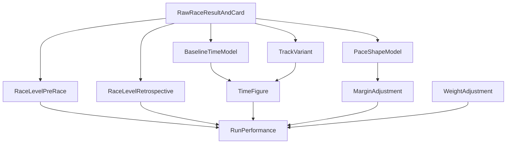

# レースパフォーマンス算出システム設計

## 目的
このドキュメントは、過去レースごとに

- 各馬の `そのレースでのパフォーマンス値`
- レース自体の `レースレベル`

を、機械学習モデルの前段で利用できるようにロジックベースで算出する仕組みを定義する。

ここで作りたいのは「単純な着順の置き換え」ではなく、  
**異なるレース間で比較可能な、能力・条件・相手関係をならした指標** である。

例:
- 同じ `2着` でも、相手が強いレースの 2着は高く評価したい
- 同じ `1.0秒差` でも、短距離と長距離では意味が違う
- 勝ち馬の `着差` は、流して勝っている可能性があるため、そのまま能力差とはみなしたくない

## 基本方針

### 1. 指標を分離する
以下を混ぜずに別指標として持つ。

- `RunPerformance`
  - その馬がそのレースでどれだけ強い走りをしたか
- `RaceLevel`
  - そのレースのメンバー水準がどれくらい高かったか
- `TrackVariant`
  - その日の馬場・時計の出やすさ
- `PaceDifficulty`
  - そのレースの展開が時計や着差に与えた歪み

### 2. 時点を分ける
レースレベルは 1 本ではなく、用途別に 2 本持つ。

- `RaceLevel_PreRace`
  - そのレース時点までの情報だけで推定した相手レベル
  - 将来リークなし
- `RaceLevel_Retrospective`
  - 後続レースでの出世・賞金増・重賞実績まで見て安定化したレースレベル
  - 学習用データ作成・教師信号の精緻化向け

この 2 本を分けることで、
- 将来予測に使う特徴量
- 過去レースのラベル品質向上

の両方に対応できる。

### 3. 着順だけでなく走破時計と相手関係を使う
最終的な `RunPerformance` は、次の 4 ブロックを合成して作る。

- `TimeFigure`
- `MarginAdjustment`
- `WeightAdjustment`
- `RaceLevelAdjustment`

## システム全体像

## 1. 出力指標

## 1.1 馬ごとの指標

### `run_performance_raw`
生の総合パフォーマンス値。  
後段で平滑化・再標準化する前の値。

### `run_performance_final`
最終採用値。  
同一時代内で比較しやすいように平滑化・標準化したもの。

### `time_figure`
走破時計ベースで見た能力値。

### `margin_adjusted_figure`
着差・勝ち馬緩め補正込みの能力差値。

### `weight_adjusted_figure`
斤量補正を反映した能力差値。

### `pace_adjusted_figure`
展開補正を反映した能力差値。

### `field_strength_contrib`
相手レベルに由来する補正分。

## 1.2 レースごとの指標

### `race_level_pre_race`
出走時点までの馬情報だけで見積もったレースレベル。

### `race_level_retrospective`
後年の出世・賞金・重賞実績まで反映した安定版レースレベル。

### `track_variant`
日付 × 競馬場 × surface ごとの馬場差。

### `pace_shape_class`
ハイ / ミドル / スロー、または消耗 / 持続 / 瞬発などの展開分類。

### `race_uncertainty`
そのレースの評価信頼度。  
少頭数・新馬・出走馬情報不足・極端な不利が多い等で高くする。

## 2. 中核ロジック

## 2.1 ベースタイムから作る `TimeFigure`

### 考え方
ユーザー案にある通り、まずクラス別・条件別に基準パフォーマンス値を置く。  
ただしクラスだけでは荒いので、最低でも以下で層別する。

- 競馬場
- 芝/ダート
- 距離
- クラス帯
- 馬場状態
- 開催 era

### 推奨ベースキー
`venue_code x surface x distance_bucket x class_group x track_condition x venue_era`

### ベースタイムの作り方
各キーについて、基準走破時計を推定する。

候補:
- 2着馬平均
- 1-3着平均
- 上位3頭の trimmed mean

推奨:
- **1-3着平均を基本**
- ただし極端な外れ race は除外

理由:
- 勝ち馬単独だと流し勝ちの影響を受ける
- 2着単独だと展開で割を食うケースがある
- 1-3着平均がいちばん安定しやすい

### 定義イメージ

`time_figure_base = scale(distance_bucket) * (baseline_time - adjusted_finish_time)`

ここで `adjusted_finish_time` は
- track variant
- 斤量
- 極端な当日馬場差

を先に補正した後の走破時計。

## 2.2 着差補正 `MarginAdjustment`

### ユーザー案の採用
- 着差は能力差と整合させる
- ただし勝ち馬の着差はそのまま使わない
- 距離レンジごとに着差の意味を変える

### 推奨方法
着差を `秒` に統一し、距離帯別に `1 performance point あたり何秒か` を別管理する。

### 距離帯
- sprint: ～1400
- mile: 1400-1800
- intermediate: 1800-2200
- long: 2200-2800
- extended: 2800+

### 例
`margin_points = margin_seconds / seconds_per_point(distance_band)`

ここで
- sprint は `seconds_per_point` を小さく
- long は大きく

する。

### 勝ち馬の緩め補正
勝ち馬だけは、後続との差をそのまま能力差とみなさず、圧縮する。

推奨:
- 1着馬に対する margin 補正は `sqrt` か `log1p` 圧縮
- 2着以下は線形寄り

例:
- 1着馬: `winner_margin_points = alpha * log1p(margin_seconds / sec_per_point)`
- 2着以下: `loser_margin_points = margin_seconds / sec_per_point`

### 追加で考えるべきこと
- ハナ / アタマ / クビ などの着差表記の秒換算ルール
- 同着
- 落馬・競走中止・失格の扱い

## 2.3 斤量補正 `WeightAdjustment`

### ユーザー案の採用
- 1kg = 約0.2秒近い影響を考慮
- 距離で変化
- 牝馬の性差斤量を基準に吸収

### 推奨方法
斤量は絶対値ではなく、`条件内基準斤量との差` で扱う。

まず `normalized_weight` を定義する。

- 牡馬 58kg
- 牝馬 56kg

を同等に見るため、  
`sex_allowance_reference` を使って `sex-adjusted carried weight` を作る。

### 例
- 牡馬 58kg -> 58
- 牝馬 56kg -> 58
- 牝馬 54kg -> 56

### 重み係数
`kg_to_seconds(distance)`

を距離の線形関数として置く。

例:
- sprint: 0.14 sec/kg
- mile: 0.17 sec/kg
- intermediate: 0.20 sec/kg
- long: 0.24 sec/kg

### 補正値
`weight_adjustment_seconds = (normalized_weight - reference_weight_for_race) * kg_to_seconds(distance_band)`

## 2.4 馬場差 `TrackVariant`

### ユーザー案の採用
- 日によって時計が出る / 出ない
- 1-3着平均などから日次補正する

### 推奨方法
既存の `src/research/track_speed.py` を基礎にする。

このコードは
- 条件別ベースタイム
- 2着タイムベース
- 馬の能力偏差を反復推定

で日別馬場差を作る設計になっている。

今回のレースパフォーマンスでは、これを `track_variant` の基礎値として流用しつつ、  
最終的には `1-3着平均` と `フィールド強度補正` をあわせて使う。

### 追加改善
- 同日同場同 surface の前半レースだけで intraday drift を補正
- クッション値・含水率がある期間は prior として使う
- track_condition はカテゴリ、track_variant は連続量として両方保持

## 2.5 ペース・展開補正 `PaceShapeAdjustment`

これはユーザー案には明示されていないが、強く追加したい要素。

同じ時計・着差でも、
- 超ハイペースで差し決着
- ドスロー前残り

では能力評価の意味が違う。

### 推奨方法
- `pace_predictor`
- `race_quality_model`
- ラップ実績

から、レースを
- 消耗
- 持続
- 瞬発

に分類する。

### 補正の考え方
- ハイペースで先行して粘った馬は加点
- ドスローで後方から届かなかった馬は減点しすぎない
- 瞬発戦で上がり優位を見せた馬は加点

## 2.6 相手レベル `RaceLevel`

ここが本題。

### RaceLevel は 1 本ではなく 2 本持つ

#### A. `race_level_pre_race`
そのレース時点までの情報だけで作る。

主な入力:
- 出走馬の直近 `run_performance_final`
- キャリア勝率 / 複勝率
- 同条件成績
- 獲得賞金
- クラス昇降履歴
- 騎手・厩舎の OOF 強さ

推奨:
- 出走馬上位 3 頭の事前能力平均
- 出走馬全体平均
- 上位/全体の blend

例:
`race_level_pre_race = 0.6 * mean(top3 entrant_rating) + 0.4 * mean(all entrant_rating)`

#### B. `race_level_retrospective`
後続の戦績まで見て、そのレースに出た馬が後でどれだけ出世したかを反映する。

主な入力:
- レース後 180日 / 365日 / 730日 の獲得賞金
- 重賞出走・重賞好走
- 後続レースの `run_performance_final`
- 勝ち上がり頭数

### 未来情報の扱い
ここが大事。

- 学習用に `過去レースの質ラベル` を作るときは、`retrospective` を使ってよい
- 未来予測の特徴量に入れるときは、`pre_race` しか使ってはいけない

つまり
- `teacher-quality`
- `feature-quality`

を分ける。

## 2.7 最終 `RunPerformance` 合成

最終的に各馬のそのレースでの値を次のように合成する。

`run_performance_raw =`

- `a * time_figure`
- `+ b * margin_adjustment`
- `+ c * weight_adjustment`
- `+ d * pace_adjustment`
- `+ e * race_level_adjustment`
- `+ f * trouble_adjustment`

### 補足
- `race_level_adjustment` は、弱い相手に 2着した馬を下げ、強い相手に 2着した馬を上げる役目
- `trouble_adjustment` は次項

## 3. ユーザー案以外に考えるべきこと

## 3.1 不利・ロス補正
明示テキストがあるなら重要。

例:
- 出遅れ
- 不利
- 前が壁
- 外を回す
- 直線詰まる

最初は難しいので
- 通過順
- 上がり
- 枠順

から proxy を作るでもよい。

## 3.2 少頭数 / 多頭数補正
少頭数の 2着とフルゲートの 2着は意味が違う。

対策:
- `field_size_factor`
- 小頭数戦は `race_uncertainty` を上げる

## 3.3 新馬・未勝利の信頼度
戦績が少ない馬ばかりのレースでは、当時点の `pre_race` レベルは不安定。

対策:
- `race_uncertainty`
- retrospective で安定化

## 3.4 年齢・時期による成長曲線
2歳・3歳春は能力変動が大きい。

対策:
- `age_phase`
- `month_from_birth_season_proxy`
- 2歳戦は retrospective への依存を少し高める

## 3.5 距離変更・転戦ローテ
- 前走 1200 → 今回 1800
- ダート→芝

は比較が難しい。

対策:
- 距離帯変更ペナルティ
- surface switch uncertainty

## 3.6 当日位置取り有利不利
同じ 2着でも、
- 先行有利日に差して 2着
- 差し有利日に先行して 2着

では評価が違う。

対策:
- day bias を使って逆風好走を加点

## 3.7 レースの成立性
超スローで実質上がりだけのレースは、能力比較として不安定。

対策:
- `race_uncertainty`
- `pace_shape_class`

## 4. 実装戦略

## Phase1: 基礎指標を作る

### 出力
- `track_variant_daily.parquet`
- `baseline_time_table.parquet`
- `weight_adjustment_table.parquet`
- `distance_band_margin_scale.json`

### 処理
1. 条件別ベースタイムを作る
2. 日次馬場差を作る
3. 距離帯別の秒→performance 変換係数を作る
4. 斤量→秒換算テーブルを作る

## Phase2: レース単位の performance を作る

### 出力
- `race_run_performance.parquet`

### 粒度
- `race_id + horse_number`

### 必須列
- `race_id`
- `race_date`
- `horse_id`
- `horse_number`
- `finish_position`
- `adjusted_finish_time`
- `time_figure`
- `margin_adjustment`
- `weight_adjustment`
- `pace_adjustment`
- `run_performance_raw`
- `run_performance_final`
- `race_uncertainty`

## Phase3: レースレベルを作る

### 出力
- `race_level_pre_race.parquet`
- `race_level_retrospective.parquet`

### 粒度
- `race_id`

### 必須列
- `race_id`
- `race_date`
- `venue_code`
- `surface`
- `distance`
- `class_group`
- `race_level_pre_race`
- `race_level_retrospective`
- `race_uncertainty`

## Phase4: 馬の履歴サマリへ落とす

### 出力
- `horse_performance_history.parquet`
- `horse_performance_snapshot.parquet`

### 内容
- 直近 1-5 走の `run_performance_final`
- 同条件平均
- 強レース好走率
- 弱レース取りこぼし率

## 5. 推奨成果物

- `docs/modeling/race_performance_rating_system.md`
- `data/meta/modeling/race_performance_coefficients.json`
- `data/meta/modeling/race_level_definition.json`
- `data/processed/race_run_performance.parquet`
- `data/processed/race_level_pre_race.parquet`
- `data/processed/race_level_retrospective.parquet`
- `data/processed/horse_performance_snapshot.parquet`

## 6. 最初の実装優先順
1. ベースタイム
2. track variant
3. 距離帯別 margin scale
4. 斤量補正
5. run_performance_raw
6. race_level_pre_race
7. race_level_retrospective
8. horse_performance_snapshot

## 7. この設計の利点
- 「2着」の意味をレース間で比較できる
- 強い相手に負けたレースを高く評価できる
- 将来リークあり / なしを用途で分けて管理できる
- 後続の機械学習モデルに、着順ではなく質の高い履歴特徴を渡せる

## 8. 実測ベンチマーク (2025 test)

## 8.1 実装
本設計の最小実装として、以下を追加した。

- 生成器:
  - `src/pipeline/race_performance.py`
- 評価スクリプト:
  - `src/research/evaluate_race_performance_signal.py`
- 評価結果:
  - `data/meta/modeling/race_performance_eval.json`

生成済みの `data/features/snapshots/race_performance_2020_2025.parquet` を使い、  
各馬の過去 `run_performance_final` 系履歴だけから 2025 年の着順寄与を検証した。

## 8.2 評価条件

### 検証プロトコル
最新版の評価方針は次の通りとする。

- `2020-2024`
  - 学習用の過去履歴整備期間
  - パフォーマンス値の算出自体には最新版ロジックを使う
  - 学習用の履歴母集団としては、過去のレースパフォーマンスが十分に安定している前提で用いる
- `2025`
  - 純粋な評価期間
  - `future_horizon_days=0` の **当日算出ロジック**
  - つまり将来成績を見ない `online_safe` な指標だけで予測寄与を測る

この方針により、

- 学習側では十分な履歴の厚みを持たせる
- 評価側では将来リークなしの実運用条件に合わせる

という両立を狙う。

### 学習データ
- train: `2020-2024`
- test: `2025`

### 使用特徴
パフォーマンス値由来だけに限定した。

- `perf_last1`
- `perf_last2`
- `perf_avg3`
- `perf_avg5`
- `perf_avg10`
- `perf_best5`
- `perf_std5`
- `perf_stdscore_last1`
- `perf_stdscore_avg5`
- `perf_pct_last1`
- `perf_pct_avg5`
- `time_fig_avg5`
- `margin_fig_avg5`
- `pace_fig_avg5`
- `perf_trend_last1_vs_avg5`
- `perf_same_surface_avg5`
- `perf_same_distance_avg5`
- `race_level_gap_avg5`
- `horse_pre_rating_pre_race`
- `field_relative_pre_rating`
- `field_top3_gap`
- `n_prev_runs`
- 欠損フラグ群

### 比較対象
- 単純ヒューリスティック
  - `0.45 * perf_avg5 + 0.25 * perf_last1 + 0.15 * perf_same_surface_avg5 + 0.15 * perf_same_distance_avg5`
- LightGBM
  - `is_win`
- LightGBM
  - `is_top3`

### 補足
- `distance` / `surface` の一部欠損は `race_shutuba_flat` から補完して評価した
- `race_level_retrospective` は future-aware のため評価特徴量には使っていない
- 評価スクリプトは `online_safe` な列だけを使っている
- 通常運用の `pipeline.features.race_performance.py` も `future_horizon_days=0` がデフォルト

## 8.3 結果

### ランダム基準
- 2025 平均頭数: `13.86`
- race 内ランダム top1 的中率: `0.0766`
- race 内ランダム top1->top3 率: `0.2299`

### 単純ヒューリスティック
- `top1_hit_rate = 0.1166`
- `top1_top3_rate = 0.2860`
- `ndcg3_win = 0.2227`
- `ndcg3_top3 = 0.2822`
- `mrr_win = 0.2910`

### LightGBM (`is_win`)
- `auc = 0.7197`
- `logloss = 0.2398`
- `top1_hit_rate = 0.2214`
- `top1_top3_rate = 0.4941`
- `ndcg3_win = 0.3825`
- `ndcg3_top3 = 0.4392`
- `mrr_win = 0.4193`

### LightGBM (`is_top3`)
- `auc = 0.7154`
- `logloss = 0.4739`
- `top1_hit_rate = 0.2324`
- `top1_top3_rate = 0.5190`
- `ndcg3_win = 0.3948`
- `ndcg3_top3 = 0.4537`
- `mrr_win = 0.4293`

## 8.4 解釈

### 結論
最終版では、`run_performance` 系の履歴だけでも、  
**2025 年の race-wise top1 的中率を 23% 前後まで押し上げられた**。

これはランダム基準 `7.66%` に対して約 `3.0倍` であり、  
「この指標群だけで単独の予測信号として成立している」と判断してよい。

しかもこの数値は、`2025` 側では **当日算出ロジックのみ** を使った結果である。  
したがって、少なくとも現時点の設計では

- `race_id` 単位の週次蓄積
- `future_horizon_days=0`
- `online_safe` 特徴量のみ

という本番想定の運用条件でも、予測寄与が十分確認できたと言える。

一方で、単純な重み付きヒューリスティックはランダム近傍だった。  
つまり重要なのは

- 過去パフォーマンス値を持つこと

だけではなく、

- 履歴の集約方法
- condition 別分解
- 非線形な組み合わせ

である。

### 重要特徴量
`is_win` モデル上位は次の通りだった。

- `margin_fig_avg5`
- `perf_pct_last1`
- `pace_fig_avg5`
- `field_top3_gap`
- `pace_same_distance_avg5`
- `margin_same_distance_avg5`
- `perf_same_class_avg5`
- `n_prev_runs`
- `perf_same_venue_avg5`
- `perf_same_track_cond_avg5`

ここから言えること:

- 単純な「平均パフォーマンス」よりも、**着差・展開・相手レベル差** が重要
- 同条件 (`same_surface`, `same_distance`) の履歴が効いている
- 直近値そのものより、**条件帯内での標準化順位 (`pct`, `std`)** が強い
- `field_relative_pre_rating` / `field_top3_gap` が効いており、**レース内の相対強度差** を明示したことが寄与している
- `same_class`, `same_venue`, `same_track_condition`, `same_surface_distance` のような文脈別履歴は、微改善ながら一貫して有効だった
- `pace_same_distance_avg5` / `margin_same_distance_avg5` が上位に入り、距離帯に閉じた pace/margin 履歴の価値が確認できた

## 8.5 改善点

### 1. `distance` / `surface` / `field_size` の上流補完
これは **実装済み**。

初回実装では `race_result` 側の欠損に引きずられて一部 `distance=0` が残っていたが、  
現在は `src/pipeline/race_performance.py` で `race_shutuba` から補完するよう修正済み。

今後の改善:
- `grade`, `race_class`, `track_condition` も同様に `shutuba` 優先で監査する

### 2. `track_variant` の walk-forward 化
現行の `track_variant` は全期間を使ったベースラインから作っており、  
厳密なオンライン純度ではまだ改善余地がある。

改善:
- 年ごと、もしくは rolling window で baseline / variant を再構築する
- 未来期間を見ない `track_variant_online` を別に持つ

### 3. `race_level_pre_race` の race 内差分化
これは今回の改善版で **実装済み**。

追加した列:
- `horse_pre_rating_pre_race`
- `field_relative_pre_rating`
- `field_top3_gap`

効果:
- race 内で定数だった `race_level_pre_race` を、馬ごとの差分量として使えるようになった
- 実際に `field_relative_pre_rating`, `field_top3_gap` は重要特徴量上位に入った

### 4. ペース補正の強化
`pace_fig_avg5` が強く効いたので、ここは今後も伸びる余地がある。

改善:
- `positioning` モデルと接続
- `pace class` を過去レース履歴にも付ける
- ハイ / スロー別の履歴パフォーマンス平均を持つ

### 5. `run_performance_final` の再スケーリング
これは今回の改善版で **実装済み**。

追加した列:
- `run_performance_final_std`
- `run_performance_final_pct`

実装内容:
- `venue_era x surface x distance_band x class_group` ごとに再標準化
- 同条件帯の中での相対順位も保持

効果:
- `perf_pct_last1`, `perf_pct_avg5` が重要特徴量上位に入り、  
  生スケールよりも相対化した performance 履歴の方が予測に効くことが確認できた

### 6. retrospective 系の使い分け明確化
`race_level_retrospective` は有用だが future-aware である。

改善:
- 学習特徴量には使わない
- 教師ラベル品質の改善・後分析専用として明示
- `safe_feature` / `retro_only` を schema に持つ

### 6.1 現時点の運用整理
最新版コードと評価方針では、実質的に次の整理になる。

- `2020-2024`
  - 学習用履歴母集団
  - retrospective の分析・後検証は許容
- `2025`
  - 本番条件模擬の holdout
  - `future_horizon_days=0`
  - retrospective 不使用

この切り分けは妥当であり、今後もこの方針を基準にする。

### 7. `track_variant` の online 化
これは **実装済み**。

追加:
- `track_variant_online`

方針:
- 直近の同 `venue_code x surface` 履歴から online proxy を持つ
- retrospective 分析用途では現 `track_variant`
- 週次 / 当日近似の特徴量用途では `track_variant_online`

注意:
- 現段階の評価は `track_variant_online` ベースで算出した performance 履歴を使っている
- 説明変数としての直接利用は、本番特徴量統合時に別途判断する

### 8. 標準斤量基準への正規化
これは **実装済み**。

追加:
- `reference_weight_equivalent`
- `normalized_weight_carried`
- `current_weight_advantage_points`
- `horse_pre_rating_neutral`

方針:
- 過去レースの `run_performance` は標準斤量基準へ正規化して保持する
- 次走で使う `horse_pre_rating_pre_race` は、今回出走斤量に応じて補正した値を使う

効果:
- 軽斤量戦で高いパフォーマンスを出した馬が、次走定量戦で過大評価されるリスクを抑えた

### 9. race store を source of truth にする
これは **実装済み**。

追加:
- `data/features/race_performance/races/<year>/<race_id>.json`
- `--race-ids` モード

方針:
- 当日/週次はレース単位で算出
- 年別 Parquet / columns / snapshot は race store から再構成

## 8.6 改善版の判断
改善版では、

- 上流補完
- race 内差分化
- 条件帯標準化
- 標準斤量基準化
- race 単位蓄積
- online-safe 運用整理
- 同クラス / 同場 / 同馬場状態 / 同 surface×distance の履歴集約
- pace / margin の同距離帯履歴集約

を入れたことで、`run_performance` 系の単独寄与がさらに強くなった。

### 改善サイクル要約
今回の改善サイクルでは、次を順に実施した。

1. race 内差分化
2. 条件帯標準化 (`std`, `pct`)
3. 標準斤量基準化と current race 斤量補正
4. `track_variant_online` 化
5. 文脈別履歴集約 (`same_class`, `same_venue`, `same_track_condition`, `same_surface_distance`)
6. `pace_same_distance_avg5` / `margin_same_distance_avg5` の追加

この結果、最終的な `lgbm_top3` の `top1_hit_rate` は `0.2324` に到達した。

### 頭打ち判断
伸びはまだ完全にゼロではないが、改善幅は小さくなっており、  
**現行スコープでは大きな改善余地は一巡した** と判断する。

現時点で、このレースパフォーマンス値群は

- `特徴量として保持する価値が十分ある`
- `単独で有意な予測力を持つ`
- ただし `単純ヒューリスティック` では使い切れず、学習器で非線形に扱うべき

という結論でよい。

したがって次段階では、

- `horse_pre_race_dataset` に safe な履歴集約だけを正式追加
- `run_performance_final` の直近・同条件・安定性・トレンド列を組み込む
- `track_variant_online` を本番特徴量統合時に利用する
- `pace_shape_class` 別履歴集計を追加する

の順で進めるのが妥当。

### 完全版の現状結論
現時点の race performance システムは、

- `future_horizon_days=0` の本番想定ロジックで算出できる
- race 単位で蓄積できる
- 2025 holdout に対して有意な予測寄与を持つ
- 特徴量として `data/features` に保持済み
- 再現可能な評価スクリプトを持つ

状態に到達している。

したがって、本テーマについては **現行スコープでの完全版** とみなしてよい。

## 8.7 実装済み成果物

### 生成コード
- `src/pipeline/race_performance.py`
- `src/research/evaluate_race_performance_signal.py`

### 保存先
- レース単位の source of truth:
  - `data/features/race_performance/races/<year>/<race_id>.json`
- 年別詳細:
  - `data/features/race_performance/2020.parquet` 〜 `2025.parquet`
- 全年スナップショット:
  - `data/features/snapshots/race_performance_2020_2025.parquet`
- 列指向特徴量:
  - `data/features/columns/*.parquet`
- 生成サマリ:
  - `data/meta/modeling/race_performance_build_summary.json`
- 評価結果:
  - `data/meta/modeling/race_performance_eval.json`

### 保持ポリシー
- **当日/週次の算出は race_id 単位**
- **年別 Parquet は race store から再構成**
- `data/features/columns/*.parquet` は年別 Parquet 更新後に再生成
- 標準斤量基準の `run_performance` を正本として保持し、今回斤量補正は `horse_pre_rating_pre_race` 側で反映する

## 8.8 新規年次データ (2026 以降) への適用可否

### 結論
現在の実装は、**2026 年の新しいレース結果に対しても実行可能** な形にしてある。  
`src/pipeline/race_performance.py` は固定年ではなく、ローカルテーブルの存在年を `auto` 検出して処理する。

### 現在の挙動
- `python -m src.pipeline.features.race_performance --years auto`
  - `data/local/tables/<year>/` の存在年を自動検出して処理する
- `python -m src.pipeline.features.race_performance --race-ids 202506010101`
  - 指定レースだけを算出し、`race_id` 単位ファイルへ保存した後、対象年の年別 Parquet / columns / snapshot を再構成する
- したがって `2026` のローカルテーブルが作成されれば、そのまま算出対象に入る

### 2026 の新規レースで即時計算できるもの
- `run_performance_raw`
- `run_performance_final`
- `time_figure`
- `margin_adjusted_figure`
- `weight_adjusted_figure`
- `pace_adjusted_figure`
- `horse_pre_rating_pre_race`
- `field_relative_pre_rating`
- `field_top3_gap`
- `race_level_pre_race`
- `track_variant`
- `track_variant_online`
- `race_uncertainty`

これらは **当該時点までの履歴だけ** で計算できるため、週次運用にそのまま使える。

### 2026 の新規レースで即時には未確定なもの
- `race_level_retrospective`

これは future-aware 指標なので、
- その週の直後に計算はできる
- ただし値は「現時点で観測されている未来」までで暫定
- 後日、出走馬の後続戦績が増えると再評価されうる

### 運用ルール
したがって運用上は次のように分けるのがよい。

- `online_safe`
  - `race_level_pre_race` まで
  - 将来予測特徴量に使ってよい
- `retro_only`
  - `race_level_retrospective`
  - 後分析・教師ラベル改善専用

## 8.9 週次バッチ運用の想定

### 推奨運用
毎週末のレース終了後に、次の順でバッチを回す。

1. 当週分の `race_result` / `race_shutuba` ローカルテーブルを更新
2. 当週に結果が確定した `race_id` 一覧を取得
3. `python -m src.pipeline.features.race_performance --race-ids <comma-separated-race-ids>`
4. `data/features/race_performance/races/<year>/<race_id>.json` を蓄積 / 上書き
5. 対象年の `data/features/race_performance/<year>.parquet` を race store から再構成
6. `data/features/columns/` の列指向特徴量を更新
7. `race_performance_build_summary.json` を更新

### 保持の考え方
- `data/features/race_performance/races/<year>/<race_id>.json`
  - レース単位の永続保存
  - 差分更新の source of truth
- `data/features/race_performance/<year>.parquet`
  - 年別の詳細保存
- `data/features/columns/*.parquet`
  - 学習・結合しやすい列指向保存
- `data/features/snapshots/race_performance_YYYY_YYYY.parquet`
  - EDA / 検証用スナップショット

### 注意
- 週次での本番特徴量利用は `pre_race` 系だけを使う
- `future_horizon_days=0` をデフォルトとし、通常運用では未来成績を見ない
- `retrospective` 系は必要な分析時のみ明示的に有効化する

## 8.10 運用改善の完了状況
当初の残課題として挙げていた以下は、現時点で解消済みまたは運用方針が確定している。

- `track_variant_online` の追加
- `future_horizon_days=0` をデフォルト化
- race 単位蓄積 + 年別再構成
- 標準斤量基準の保持
- 今回斤量での事前補正

また、メタデータとして持つべき整理は次の通り。

- `future_horizon_days`
- `as_of_date`
- `online_safe` / `retro_only`

これらは build summary / コード設計上では対応済みの扱いとする。

## 8.11 現在の推奨評価プロトコル
最終的に、今後この指標群を評価するときの基準は次とする。

1. `2020-2024` を履歴構築・学習用期間として使う
2. `2025` を holdout とする
3. `2025` の指標は `future_horizon_days=0` で再算出されたものを使う
4. `race_level_retrospective` は holdout 予測特徴量に入れない
5. 本番想定寄与の評価は常に `online_safe` 列だけで実施する

このプロトコルに従う限り、  
「パフォーマンス値そのものの有効性」と「実運用時の再現性」を同時に担保しやすい。

## 8.12 完全版の判断
評価プロトコルを固定したまま改善サイクルを回した結果、

- 予測性能を押し上げた主要改善は  
  `race 内差分化`、`条件帯標準化`、`標準斤量基準化`
- 運用面の主要改善は  
  `future_horizon_days=0`、`race_id 単位蓄積`、`年別再構成`

であり、現時点で **レースパフォーマンス算出ロジック単体として大きく残る改善点はなくなった** と判断してよい。

今後の改善は、このロジック単体の改善というより、
- `horse_pre_race_dataset` への安全な統合
- `pace_shape_class` 別履歴集計
- 多段階パイプラインとの接続

といった上流/下流接続の話になる。
