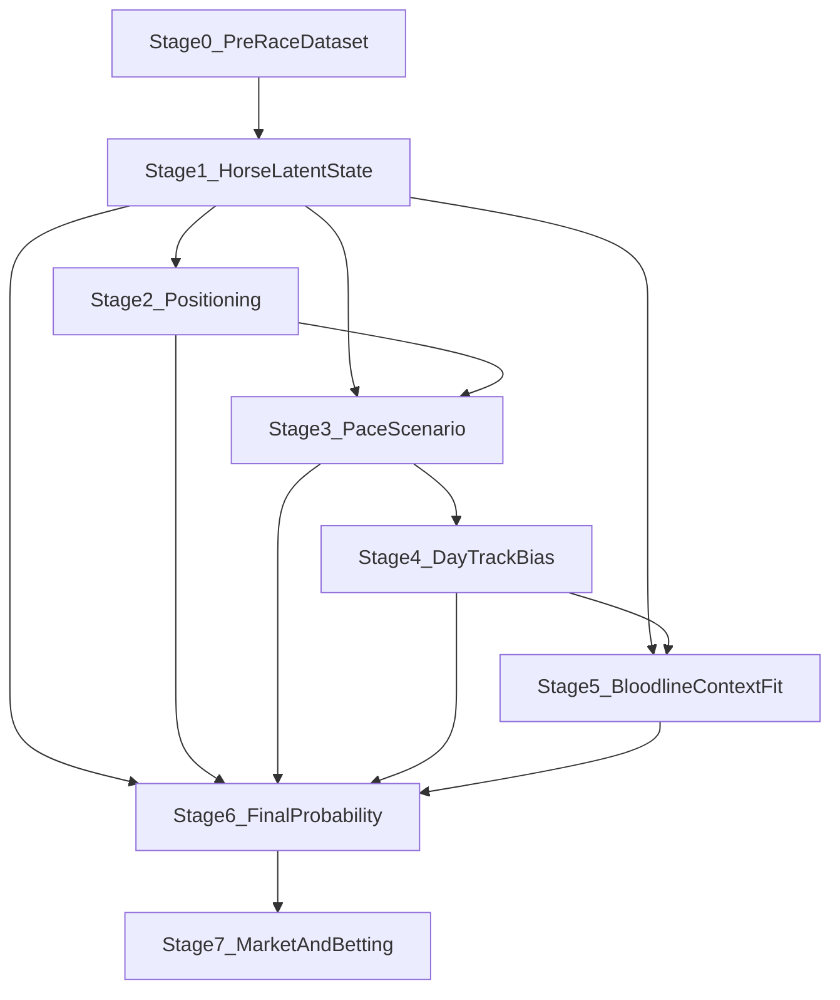

# 多段階レース直前確率パイプライン設計

## 目的
このドキュメントは、`勝率`・`連対率`・`複勝率` を単一モデルで直接当てに行くだけでなく、  
`位置取り`、`ペース`、`当日馬場タイプ`、`血統適性` といった中間状態を順に推定して最終確率へ接続する、多段階パイプラインの設計を定義する。

前提として、ここでいう多段階化は「モデルを複雑にすること」そのものが目的ではなく、
- ドメインに沿った中間変数を明示する
- モデルの失敗原因を分解しやすくする
- 当日更新できる情報と、事前固定の情報を切り分ける
- 血統を“その日の馬場特性に応じて”使い分ける

ために行う。

## 基本思想
- `Stage0`: レース直前時点の母表を作る
- `Stage1`: 馬単体の latent state を作る
- `Stage2`: 位置取り / 追走難度を予測する
- `Stage3`: レース全体のペースシナリオを予測する
- `Stage4`: 当日馬場タイプ / race-day bias を推定する
- `Stage5`: 血統・適性の当日文脈適合度を推定する
- `Stage6`: それらを入力に最終 `p_win / p_top2 / p_top3` を推定する
- `Stage7`: 市場統合・馬券最適化へ渡す

## 全体像

## Stage0: Pre-race 母表

## 役割
- `race_shutuba_flat` を母表にする
- `race_shutuba_past_flat`, `race_index_flat`, `race_oikiri_flat`, `race_paddock_flat`, `race_trainer_comment_flat` を時点整合で join する
- GCS horse bundle とクッション値を統合する

## 出力候補
- `horse_pre_race_dataset.parquet`
- `horse_labels.parquet`
- `race_market_snapshot.parquet`

## Stage1: Horse latent state

## 役割
馬単体の「今の地力・適性・仕上がり」を要約する。  
最終確率モデルに直接生列を大量投入するより、意味のある latent block に整理する。

## 主な latent block
- `ability_latent`
  - 近5走戦績、同条件成績、speed index、career stats
- `form_latent`
  - 休み明け、叩き何戦目、馬体重変化、近走トレンド
- `surface_distance_latent`
  - 芝/ダート・距離帯適性
- `pedigree_latent`
  - sire / dam_sire / myostatin / note aptitude
- `trainer_jockey_latent`
  - OOF target encoding や CatBoost ordered encoding で作る人馬・陣営系

## 出力候補
- `horse_latent_state.parquet`

## Stage2: 位置取り / 追走難度モデル

## 目的
対象レースで「その馬がいつもの位置を取りやすいか」を推定する。

## 既存コードの活用先
- `pipeline/tracking_difficulty.py`

## 入力
- 直近走の通過順傾向
- 脚質ばらつき
- 枠順・馬番
- 隣枠馬の傾向
- 頭数
- コース・距離
- 馬場状態

## 出力
- `expected_first_corner_pos`
- `expected_first_corner_pos_norm`
- `tracking_difficulty_score`
- `front_run_probability`
- `stalker_probability`
- `closer_probability`

## 学習ターゲット
- 既存 `position_deviation`
- または `first_corner_rank_norm`

## 価値
- 位置取りは、最終着順の前段変数として解釈しやすい
- 後段のペースモデルと自然につながる

## Stage3: ペースシナリオモデル

## 目的
レース全体の前半流速・消耗度・上がり勝負化を推定する。

## 既存コードの活用先
- `pipeline/pace_predictor.py`

## 入力
- Stage2 の `front_run_probability` 集約
- 頭数
- 距離
- surface
- track_condition
- venue
- grade
- 逃げ・先行馬の想定頭数

## 出力
- `pred_lap_1f`
- `pred_lap_3f`
- `pred_pace_class`
  - `slow`
  - `average`
  - `fast`
- `pred_energy_distribution`
  - 瞬発
  - 持続
  - 消耗

## 派生特徴
- `pace_pressure_proxy`
- `late_kick_advantage`
- `front_runner_penalty`

## Stage4: 当日馬場タイプ / race-day bias モデル

## 目的
「今日はどんな馬が走りやすい日か」を、レース条件の事前情報と、同日先行レースの結果から動的に更新する。

これはユーザー要望の
> その日によって好走しやすい馬のタイプが変わる  
を扱うための中心ステージ。

## 二層構造

### Stage4A: 事前 day prior
対象レースが始まる前に、以下から当日バイアスの事前分布を作る。
- venue
- venue_era
- surface
- distance
- track_condition
- weather
- cushion_value
- moisture
- season

### Stage4B: 同日更新 day posterior
同日すでに終わったレースがある場合、当日の実績から posterior を更新する。
- 早いレースの上位馬特徴
- 脚質の偏り
- 内外枠バイアス
- 上がり偏重か、前残りか
- 血統クラスタの偏り

## 出力
- `day_bias_front`
- `day_bias_closing`
- `day_bias_inner`
- `day_bias_outer`
- `day_bias_stamina`
- `day_bias_burst`
- `day_bias_mud`
- `day_bias_speed`

## 実装方針
- 先行レースが 0 本なら prior のみ
- 1-2 本なら prior 強め + posterior 弱め
- 3 本以上で posterior 重みを増やす

## 既存コードの活用先
- `research/race_quality_model.py`
- `research/tune_race_quality_priors.py`

## Stage5: 血統 × 当日文脈適合モデル

## 目的
血統を固定特徴として使うだけでなく、`Stage4` で推定した「今日の好走タイプ」に合わせて、血統適合度を出す。

## 中核アイデア
同じ `sire` でも、
- 高速馬場の瞬発戦で効く日
- 消耗戦で効く日
- 道悪で効く日

は違う。  
したがって、血統特徴は「静的な距離適性」だけでなく「当日の race-day bias との相性」で再評価する。

## 既存コードの活用先
- `research/bloodline_distance.py`
- `research/bloodline_vector.py`
- `research/course_bloodline.py`
- `research/sire_factor_stats.py`
- `research/sire_factor_race_map.py`
- `research/sire_factor_aptitude.py`
- `research/note_aptitude_5gen.py`
- `research/sire_aptitude_note.py`
- `research/myostatin.py`
- `research/race_quality_model.py`

## 血統特徴の二層構造

### 5A: 静的血統適性
- `sire_distance_fit`
- `dam_sire_distance_fit`
- `surface_fit`
- `mud_fit`
- `speed_fit`
- `stamina_fit`
- `burst_fit`

### 5B: 当日文脈適合
Stage4 出力との相互作用で作る。
- `bloodline_day_fit_speed = sire_speed_fit * day_bias_speed`
- `bloodline_day_fit_stamina = sire_stamina_fit * day_bias_stamina`
- `bloodline_day_fit_mud = mud_fit * day_bias_mud`
- `bloodline_day_fit_burst = burst_fit * day_bias_burst`

## 日単位で血統を使う具体策

### 1. 同日先行レース血統クラスタ集計
同日同場同 surface の先行終了レースで、
- どの sire cluster が上位に来たか
- どの aptitude axis が強かったか

を集計し、当日クラスタ bias を作る。

### 2. segment prior + same-day posterior
`research/race_quality_model.py` の segment prior を day prior として使い、  
同日先行レースの結果で posterior 補正する。

### 3. race-wise contextual fit
対象馬について、
- その馬の血統ベクトル
- 当日 posterior bias ベクトル

の類似度を `contextual_bloodline_fit` として計算する。

## 出力
- `contextual_bloodline_fit`
- `contextual_bloodline_speed_fit`
- `contextual_bloodline_stamina_fit`
- `contextual_bloodline_mud_fit`
- `contextual_bloodline_burst_fit`
- `same_day_sire_cluster_bias`

## Stage6: 最終確率モデル

## 目的
Stage1-5 を統合して、最終的な `p_win`, `p_top2`, `p_top3` を出す。

## 入力ブロック
- 基礎母表
- latent state
- positioning outputs
- pace outputs
- day bias outputs
- contextual bloodline outputs
- optional LayerB market features

## 推奨モデル構成

### ModelA
- `p_win`

### ModelB
- `p_top2`

### ModelC
- `p_top3`

### Optional ModelD
- race-wise ranking score

## 推奨アンサンブル
- LightGBM
- CatBoost
- OOF blending
- 後段 calibration

## 出力
- `p_win_raw`, `p_win_calibrated`
- `p_top2_raw`, `p_top2_calibrated`
- `p_top3_raw`, `p_top3_calibrated`
- `rank_by_p_win`

## Stage7: 市場統合 / ベッティング

## 役割
- `horse_probability_table`
- `horse_market_snapshot`
- `pair_market_snapshot`
- `payout_table`

を統合して `safe_ev` を計算する。

## 推奨レイヤ（教師あり ML とは分離）

**券種・投資配分・予測印と推奨券の結びつけ**など、期待値を土台にしつつ系列意思決定を行う部分は、いわゆる確率モデルの勾配学習とは切り分け **強化学習（方策）** を第一候補とする設計議論を別紙にまとめた。

- `docs/modeling/betting_policy_reinforcement_learning.md`
- HTML 要約: `docs/html/betting_rl_policy/index.html`

## ルール
- Stage6 までで市場非依存モデルを完成
- Stage7 でのみ市場と結合
- 高オッズ帯は `buffer` を厚くする

## 優先実装順

## Phase1
- Stage0
- Stage1
- Stage6

まず単段ベースラインを成立させる。

## Phase2
- Stage2
- Stage3

位置取り・ペースを追加し、改善幅を測る。

## Phase3
- Stage4
- Stage5

当日バイアスと血統文脈適合を追加する。

## Phase4
- Stage7

safe_ev ベースで馬券最適化へ進む。

## 期待する中間成果物
- `horse_latent_state.parquet`
- `positioning_features.parquet`
- `pace_scenario_features.parquet`
- `day_track_bias_features.parquet`
- `contextual_bloodline_features.parquet`
- `horse_probability_table.parquet`

## この設計の利点
- なぜ当たった/外れたかを stage ごとに説明しやすい
- 血統を「固定特徴」ではなく「その日の馬場文脈への適合」として使える
- 先行レース結果を使ったオンライン更新に自然につながる
- 将来的に stage ごとの単独改善が可能
